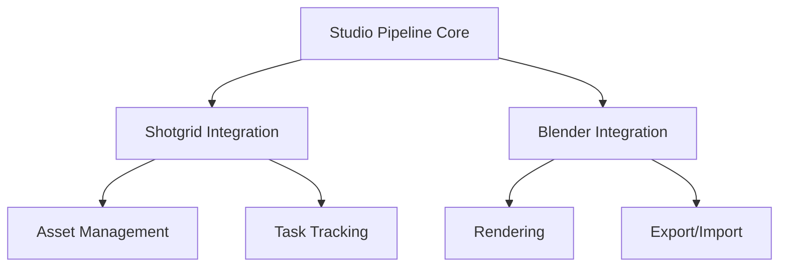

# Pipeline Overview

The Studio Pipeline is designed to streamline production workflows by integrating Shotgrid and Blender into a unified system.

## Architecture

The pipeline follows a modular architecture with three main components:



## Core Components

### Pipeline Core

The core module provides the foundational infrastructure:

- **Configuration Management**: Load and manage pipeline settings
- **Logging**: Centralized logging system
- **Path Resolution**: Standardized file path handling
- **Version Control**: Asset versioning system

### Shotgrid Integration

Handles all communication with Shotgrid:

- **API Wrapper**: Simplified Shotgrid API access
- **Entity Management**: Create, read, update entities
- **File Publishing**: Publish files to Shotgrid
- **Task Management**: Track and update task status

### Blender Integration

Provides Blender-specific functionality:

- **Scene Management**: Open, save, and manage Blender scenes
- **Rendering**: Batch rendering with various options
- **Asset Export**: Export assets in multiple formats
- **Add-on System**: Custom Blender add-ons

## Workflow

### Standard Asset Workflow

1. **Creation**: Artist creates asset in Blender
2. **Version**: Asset is versioned using the pipeline tools
3. **Review**: Asset is submitted for review via Shotgrid
4. **Publish**: Approved asset is published to production
5. **Track**: Status updates are synchronized with Shotgrid

### Rendering Workflow

1. **Setup**: Configure render settings in Blender
2. **Submit**: Submit render job through pipeline
3. **Execute**: Pipeline handles rendering (local or farm)
4. **Review**: Renders are uploaded to Shotgrid for review
5. **Deliver**: Final renders are delivered to specified location

## Configuration

The pipeline uses YAML configuration files:

```yaml
# config/pipeline.yml
project:
  name: MyProject
  root: /mnt/projects/myproject

shotgrid:
  server: https://studio.shotgunstudio.com
  project_id: 123

blender:
  version: "3.6"
  executable: /usr/bin/blender

paths:
  assets: "{project.root}/assets"
  shots: "{project.root}/shots"
  renders: "{project.root}/renders"
```

## Extending the Pipeline

The pipeline is designed to be extensible:

- Add custom modules in `src/studio_pipeline/plugins/`
- Create custom Blender add-ons in `src/studio_pipeline/blender/addons/`
- Add custom Shotgrid event handlers

## Best Practices

- **Use Version Control**: Always version your assets
- **Follow Naming Conventions**: Consistent naming helps automation
- **Document Your Work**: Add notes to Shotgrid entities
- **Test Before Publishing**: Validate assets before publishing to production
- **Keep Dependencies Updated**: Regularly update the pipeline

## Next Steps

- [Shotgrid Integration Details](shotgrid.md)
- [Blender Integration Details](blender.md)
- [API Reference](../api/core.md)
